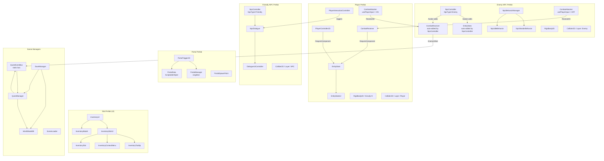

# Prefab Component Graph

```mermaid
flowchart TB

    subgraph ROW1[" "]
        subgraph ENEMY["Enemy NPC Prefab"]
            direction TB
            NC["NpcController\nNpcType=Enemy"]
            BM[NpcBehaviorManager]
            WB[NpcWanderBehavior]
            IB[NpcIdleBehavior]
            ES_E["EntityStats\nauto-added by NpcController"]
            CR_E["CombatReceiver\nauto-added by NpcController"]
            CA_E["CombatAttacker\nusePlayerInput = OFF"]
            RB_E[Rigidbody2D]
            COL_E["Collider2D / Layer: Enemy"]
            NC -->|Awake adds| ES_E
            NC -->|Awake adds| CR_E
            BM --> WB
            BM --> IB
        end
        subgraph PLAYER["Player Prefab"]
            direction TB
            PC[PlayerController2D]
            PI[PlayerInteractionController]
            ES_P[EntityStats]
            CR_P[CombatReceiver]
            CA_P["CombatAttacker\nusePlayerInput = ON"]
            UI_P[EntityStatsUI]
            RB_P["Rigidbody2D / Gravity=0"]
            COL_P["Collider2D / Layer: Player"]
            PC -->|RequireComponent| ES_P
            CR_P -->|RequireComponent| ES_P
            ES_P --> UI_P
        end
    end

    subgraph ROW2[" "]
        subgraph NPC["Friendly NPC Prefab"]
            direction TB
            NC2["NpcController\nNpcType=Friendly"]
            ND[NpcDialogue]
            DUI[DialogueUIController]
            COL_N["Collider2D / Layer: NPC"]
            NC2 --> ND
            ND --> DUI
        end
        subgraph PORTAL["Portal Prefab"]
            direction TB
            PT[PortalTrigger2D]
            PD["PortalData\nScriptableObject"]
            PM["PortalManager\nsingleton"]
            SP[PortalSpawnPoint]
            PT --> PD
            PT --> PM
        end
    end

    subgraph ROW3[" "]
        subgraph SLOT["Slot Prefab (UI)"]
            direction TB
            IUI[InventoryUI]
            IM[InventoryModel]
            ISU[InventorySlotUI]
            IS[InventorySlot]
            IC[InventoryContextMenu]
            IT[InventoryTooltip]
            IUI --> IM
            IUI --> ISU
            ISU --> IS
            ISU --> IC
            ISU --> IT
        end
        subgraph MANAGERS["Scene Managers"]
            direction TB
            QM[QuestManager]
            QEB["QuestEventBus\nstatic bus"]
            WS[WorldStateDB]
            SM[SaveManager]
            SL[SceneLoader]
            QM --> QEB
            QM --> WS
            SM --> WS
            SM --> QM
        end
    end

    CA_P -->|ReceiveHit| CR_E
    CA_E -->|ReceiveHit| CR_P
    PI -->|triggers| ND
    CR_E -->|EnemyKilled| QEB
    QEB --> QM

    style ROW1 fill:none,stroke:none
    style ROW2 fill:none,stroke:none
    style ROW3 fill:none,stroke:none
```
