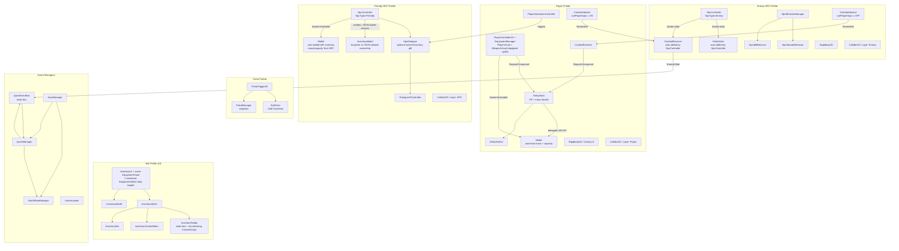

# Prefab Component Graph

```mermaid
flowchart TB

    subgraph ROW1[" "]
        subgraph ENEMY["Enemy NPC Prefab"]
            direction TB
            NC["NpcController\nNpcType=Enemy"]
            BM[NpcBehaviorManager]
            WB[NpcWanderBehavior]
            IB[NpcIdleBehavior]
            ES_E["EntityStats\nauto-added by NpcController"]
            CR_E["CombatReceiver\nauto-added by NpcController"]
            CA_E["CombatAttacker\nusePlayerInput = OFF"]
            RB_E[Rigidbody2D]
            COL_E["Collider2D / Layer: Enemy"]
            NC -->|Awake adds| ES_E
            NC -->|Awake adds| CR_E
            BM --> WB
            BM --> IB
        end
        subgraph PLAYER["Player Prefab"]
            direction TB
            PC["PlayerController2D + EquipmentManager\nPlayerVisual > WeaponVisual (equipped sprite)"]
            PI[PlayerInteractionController]
            ES_P["EntityStats\nHP + mana facade"]
            MW_P["Wallet\ncanonical mana + capacity"]
            CR_P[CombatReceiver]
            CA_P["CombatAttacker\nusePlayerInput = ON"]
            UI_P[EntityStatsUI]
            RB_P["Rigidbody2D / Gravity=0"]
            COL_P["Collider2D / Layer: Player"]
            PC -->|RequireComponent| ES_P
            PC -->|Awake finds/adds| MW_P
            ES_P -->|delegates MP API| MW_P
            CR_P -->|RequireComponent| ES_P
            ES_P --> UI_P
        end
    end

    subgraph ROW2[" "]
        subgraph NPC["Friendly NPC Prefab"]
            direction TB
            NC2["NpcController\nNpcType=Friendly"]
            ND["NpcDialogue\noptional owned-inventory gift"]
            DUI[DialogueUIController]
            INV_N["InventoryModel\nInspector or JSON-seeded ownership"]
            MW_N["Wallet\nauto-added with inventory\nmana/capacity from NPC"]
            COL_N["Collider2D / Layer: NPC"]
            NC2 --> ND
            NC2 -->|creates / JSON loader ensures| INV_N
            NC2 -->|Awake finds/adds| MW_N
            ND --> DUI
        end
        subgraph PORTAL["Portal Prefab"]
            direction TB
            PT[PortalTrigger2D]
            PM["PortalManager\nsingleton"]
            EP["ExitPoint\nchild Transform"]
            PT --> PM
            PT --> EP
        end
    end

    subgraph ROW3[" "]
        subgraph SLOT["Slot Prefab (UI)"]
            direction TB
            IUI["InventoryUI + scene EquipmentPanel\n3 serialized EquipmentSlotUI drop targets"]
            IM[InventoryModel]
            ISU[InventorySlotUI]
            IS[InventorySlot]
            IC[InventoryContextMenu]
            IT["InventoryTooltip\nwhite box + non-blocking CanvasGroup"]
            IUI --> IM
            IUI --> ISU
            ISU --> IS
            ISU --> IC
            ISU --> IT
        end
        subgraph MANAGERS["Scene Managers"]
            direction TB
            QM[QuestManager]
            QEB["QuestEventBus\nstatic bus"]
            WS[WorldStateManager]
            SM[SaveManager]
            SL[SceneLoader]
            QM --> QEB
            QM --> WS
            SM --> WS
            SM --> QM
        end
    end

    CA_P -->|ReceiveHit| CR_E
    CA_E -->|ReceiveHit| CR_P
    PI -->|triggers| ND
    CR_E -->|EnemyKilled| QEB
    QEB --> QM

    style ROW1 fill:none,stroke:none
    style ROW2 fill:none,stroke:none
    style ROW3 fill:none,stroke:none
```
