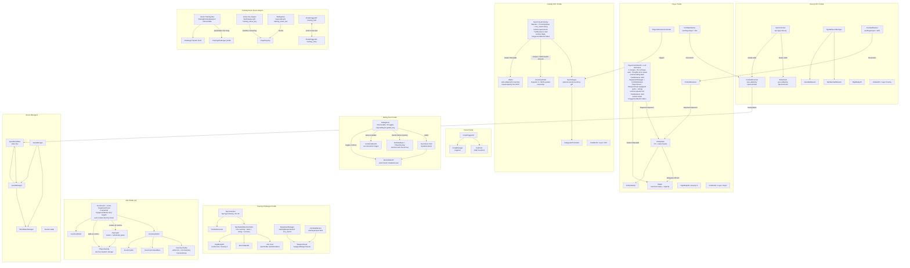

# Prefab Component Graph

```mermaid
flowchart TB

    subgraph ROW1[" "]
        subgraph ENEMY["Enemy NPC Prefab"]
            direction TB
            NC["NpcController\nNpcType=Enemy"]
            BM[NpcBehaviorManager]
            WB[NpcWanderBehavior]
            IB[NpcIdleBehavior]
            ES_E["EntityStats\nauto-added by NpcController"]
            CR_E["CombatReceiver\nauto-added by NpcController"]
            CA_E["CombatAttacker\nusePlayerInput = OFF"]
            RB_E[Rigidbody2D]
            COL_E["Collider2D / Layer: Enemy"]
            NC -->|Awake adds| ES_E
            NC -->|Awake adds| CR_E
            BM --> WB
            BM --> IB
        end
        subgraph PLAYER["Player Prefab"]
            direction TB
            PC["PlayerController2D + Left Shift dash\n3 charges, 15s recharge each, 5 lengths at 6x speed\nruntime fading dash TrailRenderer child\nEquipmentManager + CombatAttacker\nPlayerVisual > WeaponVisual (equipped sprite + swing)\nruntime tapered red TrailRenderer child\nruntime blade PolygonCollider2D hitbox"]
            PI[PlayerInteractionController]
            ES_P["EntityStats\nHP + mana facade"]
            MW_P["Wallet\ncanonical mana + capacity"]
            CR_P[CombatReceiver]
            CA_P["CombatAttacker\nusePlayerInput = ON"]
            UI_P[EntityStatsUI]
            RB_P["Rigidbody2D / Gravity=0"]
            COL_P["Collider2D / Layer: Player"]
            PC -->|RequireComponent| ES_P
            PC -->|Awake finds/adds| MW_P
            ES_P -->|delegates MP API| MW_P
            CR_P -->|RequireComponent| ES_P
            ES_P --> UI_P
        end
    end

    subgraph ROW2[" "]
        subgraph NPC["Friendly NPC Prefab"]
            direction TB
            NC2["Sword Guard Enemy\nWander + ProximityMelee + iron_sword swing\nruntime tapered red TrailRenderer child\nruntime blade PolygonCollider2D hitbox"]
            ND["NpcDialogue\noptional owned-inventory gift"]
            DUI[DialogueUIController]
            INV_N["InventoryModel\nInspector or JSON-seeded ownership"]
            MW_N["Wallet\nauto-added with inventory\nmana/capacity from NPC"]
            COL_N["Collider2D / Layer: NPC"]
            NC2 --> ND
            NC2 -->|creates / JSON loader ensures| INV_N
            NC2 -->|Awake finds/adds| MW_N
            ND --> DUI
        end
        subgraph PORTAL["Portal Prefab"]
            direction TB
            PT[PortalTrigger2D]
            PM["PortalManager\nsingleton"]
            EP["ExitPoint\nchild Transform"]
            PT --> PM
            PT --> EP
        end
        subgraph DOOR["Sliding Door Prefab"]
            direction TB
            SD["SlidingDoor\nIInteractable / E toggles\nrequiredKeyId: golden_key"]
            IDB["ItemDatabase + PlayerKeyring\nresolves and checks key"]
            DT["CircleCollider2D\nroot interaction trigger"]
            DP["DoorPanel child\nSpriteRenderer"]
            DB["BoxCollider2D\nsolid closed / disabled open"]
            SD -->|slides| DP
            SD -->|keeps available| DT
            SD -->|toggles collision| DB
            SD -->|checks before opening| IDB
            DP --> DB
        end
    end

    subgraph ROW3[" "]
        subgraph TRAINING["Training Challenger Prefab"]
            direction TB
            TC["NpcController\nNpcType=Enemy / 60 HP"]
            TCR[CombatReceiver]
            TRB["Rigidbody2D\nContinuous / Gravity=0"]
            TCOL[BoxCollider2D]
            TEQ["EquipmentManager\nstartingWeaponItemId: iron_sword"]
            TCA["CombatAttacker\nusePlayerInput=OFF"]
            TAI["NpcDashMeleeController\n0.5s warning > dash > swing > recovery"]
            TAIM["Aim Pivot\nplaceholder SpriteRenderer"]
            TW["WeaponVisual\nEquippedWeaponVisual"]
            TC --> TCR
            TC --> TAI
            TAI --> TRB
            TAI --> TCOL
            TAI --> TAIM
            TEQ --> TW
            TCA --> TW
        end
        subgraph SLOT["Slot Prefab (UI)"]
            direction TB
            IUI["InventoryUI + scene EquipmentPanel\n3 serialized EquipmentSlotUI drop targets\nauto-creates keyring viewer"]
            IM[InventoryModel]
            PK["PlayerKeyring\nslot-free KeyItem storage"]
            KUI["KeyringUI\nbutton + owned-key panel"]
            ISU[InventorySlotUI]
            IS[InventorySlot]
            IC[InventoryContextMenu]
            IT["InventoryTooltip\nwhite box + non-blocking CanvasGroup"]
            IUI --> IM
            IUI -->|adds at runtime| PK
            IUI -->|creates at runtime| KUI
            KUI --> PK
            IUI --> ISU
            ISU --> IS
            ISU --> IC
            ISU --> IT
        end
        subgraph MANAGERS["Scene Managers"]
            direction TB
            QM[QuestManager]
            QEB["QuestEventBus\nstatic bus"]
            WS[WorldStateManager]
            SM[SaveManager]
            SL[SceneLoader]
            QM --> QEB
            QM --> WS
            SM --> WS
            SM --> QM
        end
    end

    subgraph ROW4[" "]
        subgraph SPAWNER["Training Arena Scene Objects"]
            direction TB
            GB["Green Training Box\nTrainingEnemySpawner / IInteractable"]
            SP["Challenger Spawn Point"]
            TP["TrainingChallenger prefab"]
            AK["Arena Key Keeper\nNpcDialogue gift: training_arena_key"]
            KR[PlayerKeyring]
            AD["SlidingDoor\nrequiredKeyId: training_arena_key"]
            PH["PortalTrigger2D: training_hub"]
            PE["PortalTrigger2D: training_entry"]
            GB --> SP
            GB -->|instantiates one living| TP
            AK -->|transfers owned key| KR
            AD -->|checks| KR
            PH <-->|same-scene pair| PE
        end
    end

    CA_P -->|ReceiveHit| CR_E
    CA_E -->|ReceiveHit| CR_P
    PI -->|triggers| ND
    CR_E -->|EnemyKilled| QEB
    QEB --> QM

    style ROW1 fill:none,stroke:none
    style ROW2 fill:none,stroke:none
    style ROW3 fill:none,stroke:none
    style ROW4 fill:none,stroke:none
```
